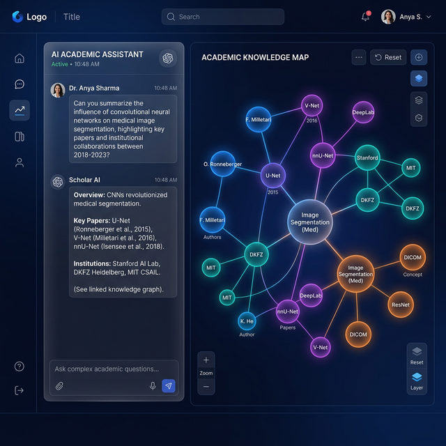
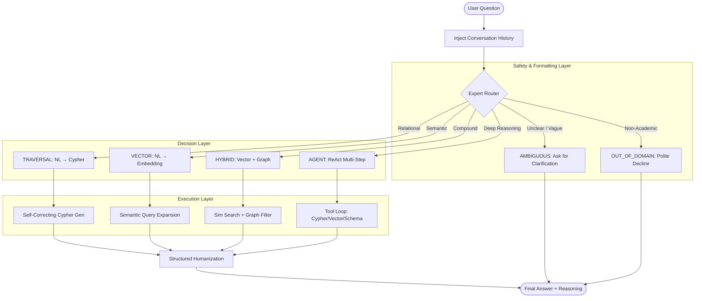
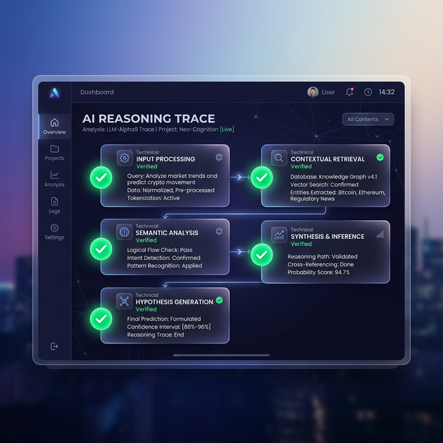

# ResearchGraph AI — Institutional Grade Knowledge Graph Assistant

<div align="center">
  
</div>

> **Domain:** Academic Research & Scientific Literature  
> **Core Stack:** **Google Gemini 1.5 (genai v1.x)** · **Neo4j Graph Database** · **FastAPI** · **React** · **SQLite** (Session Memory)

---

## 📑 Table of Contents
1. [Core Capabilities](#core-capabilities)
2. [Expert-Grade Prompt Engineering](#expert-grade-prompt-engineering)
3. [Architecture & Pipeline Logic](#architecture--pipeline-logic)
4. [Domain: Academic Research Literature](#domain)
5. [Setup & Installation](#setup--installation)
6. [Populating with Real Data](#populating-with-real-data)
7. [Running the Application](#running-the-application)
8. [Advanced Routing & Reasoning](#advanced-routing--reasoning)
9. [Premium Visuals & UX](#premium-visuals-ux)

---

## 🎯 Core Capabilities

ResearchGraph AI is a production-ready conversational system that converts **complex research questions** into high-precision database operations. It traverses dense academic networks (Authors, Citations, Venues) to provide verified, evidence-based answers.

**Expert Interaction Examples:**
- 🔗 **Relational:** `"Who authored 'Attention Is All You Need' and which institutions are they affiliated with?"`
- 🔍 **Semantic:** `"Find papers similar to Knowledge Graph Embedding that focus on parameter efficiency."`
- ⚡ **Hybrid:** `"List high-citation NLP papers published in NeurIPS after 2022 authored by Stanford researchers."`
- 🤖 **Analytical:** `"Compare the citation trajectories of transformers vs. convolutional networks over the last 5 years."`

---

## 🧠 Expert-Grade Prompt Engineering

The system has been meticulously tuned for **Zero-Greeting, High-Precision** operations:
- **Professional Persona:** The AI acts as a Senior Research Lead. No conversational fluff ("Hello!", "Sure thing!") is included unless explicitly requested.
- **Structured Reasoning:** Every response is split into `---REASONING---` (technical logic) and `---ANSWER---` (user-facing result). This ensures transparency in decision-making.
- **Context Awareness:** Multi-turn memory allows for seamless follow-up questions like *"What about their H-index?"* or *"List their most cited works."*
- **Precision Validation:** Generated Cypher queries undergo a dual-pass validation (Static + LLM Self-Critique) to ensure zero syntax errors and logical alignment.

---

## 🏗️ Architecture & Pipeline Logic

The system follows a **Classify-Route-Execute** paradigm, selecting the optimal tool for every query.



---

## 📚 Domain

**Academic Research Literature** — Real-world publications retrieved via the **Semantic Scholar API**.

| Node    | Properties                                    |
|---------|----------------------------------------------|
| **Paper**   | title, abstract, year, citations_count, doi, topics |
| **Author**  | name, h_index, email                         |
| **Journal** | name                                         |
| **Topic**   | name                                         |
| **Institution** | name, country                             |

| Relationship     | Direction                          | Description |
|------------------|------------------------------------|-------------|
| **AUTHORED**         | (Author)→(Paper)                  | Links researchers to their published work. |
| **PUBLISHED_IN**     | (Paper)→(Journal)                 | Links papers to academic venues. |
| **COVERS_TOPIC**     | (Paper)→(Topic)                   | Semantic categorization within the graph. |
| **AFFILIATED_WITH**  | (Author)→(Institution)             | Structural link to research organizations. |

---

## ⚙️ Setup & Installation

### Prerequisites
- Python 3.11+
- Node.js 18+
- Neo4j 5.x (Local or AuraDB)
- Gemini API Key

### 1. Configure Environment
```bash
cp .env.example .env
# Edit .env with your keys and Neo4j credentials
```

### 2. Backend Setup
```bash
cd backend
python -m venv venv
# Windows
venv\Scripts\activate
# Install deps
pip install -r requirements.txt
```

---

## 💾 Populating with Real Data

The system uses authentic academic data, moving away from previous mock datasets.

```bash
# 1. Fetch real papers from Semantic Scholar (e.g., Deep Learning papers)
venv\Scripts\python utils\fetch_real_data.py --query "Large Language Models" --limit 100

# 2. Seed the Neo4j database & Generate Embeddings
venv\Scripts\python db\seed_data.py
```

**Seeding Protocol:**
1. **Clears** previous data to ensure schema integrity.
2. **Graph Construction:** Creates Author-Paper-Journal relationships and handles multi-author collaborations.
3. **Vectorization:** Generates **768-dimensional embeddings** for all abstracts using a local **`all-mpnet-base-v2`** model.
4. **Indexing:** Initializes Neo4j Vector Indexes for O(1) semantic retrieval.

---

## 🚀 Running the Application

### Start Backend
```bash
cd backend
uvicorn main:app --reload --port 8000
```
*API Docs: `http://localhost:8000/docs`*

### Start Frontend
```bash
cd frontend
npm run dev
```
*UI Access: `http://localhost:5173`*

---

## 🛠️ Advanced Routing & Reasoning

<div align="center">
  
</div>

The system categorizes every request into one of six distinct pipelines to ensure speed and accuracy:

1. **GRAPH_TRAVERSAL**: Fast, deterministic Cypher execution for explicit structural queries (e.g., "Who authored X?").
2. **VECTOR_SIMILARITY**: Semantic search over dense abstract embeddings using cosine similarity.
3. **HYBRID**: Intersects vector search results with structural sub-graph constraints.
4. **AGENT_COMPLEX**: Triggers a ReAct reasoning loop for comparison, aggregation, and multi-hop discovery.
5. **AMBIGUOUS (Guardrail)**: Intercepts overly vague queries before hitting the database, prompting the user for clarification.
6. **OUT_OF_DOMAIN (Guardrail)**: Instantly declines queries unrelated to academic research, preventing hallucinations and saving LLM tokens.

**Features of the Expert Router:**
- **Context-Dependence Detection:** Uses conversation history to resolve pronouns and implicit references.
- **Fast Rule-Based Pre-filter:** Instantly detects complex intents or ambiguity using Regex before falling back to the LLM.
- **Truncation Mitigation:** Handling abstracts up to **3000 chars** and output token limits up to **4096** for exhaustive answers.

---

## 🧪 Interactive Sample Questions

Test the power of the `Expert Router` by trying out these prompts in the UI. The system will automatically detect the intent and route it to the correct pipeline.

### 1. `GRAPH_TRAVERSAL` (Structural Lookups)
*Tests explicit node and relationship navigation.*
- > "Who authored the paper 'A Survey on Knowledge Graphs: Representation, Acquisition, and Applications'?"
- > "List all the journals where Shirui Pan has published."
- > "Which papers are affiliated with the author Shaoxiong Ji?"
- > "How many citations does the paper 'Unifying Large Language Models and Knowledge Graphs: A Roadmap' have?"
- > "What is the email address of Pekka Marttinen and what is his H-index?"

### 2. `VECTOR_SIMILARITY` (Semantic Search)
*Tests dense embedding proximity without exact keywords.*
- > "Find papers related to using generative AI for question answering with knowledge structures."
- > "I'm looking for reviews on how graph neural networks are used for node classification."
- > "Suggest papers similar to Knowledge Graph representation learning."
- > "Recommend research covering multi-modal learning combined with knowledge graphs."
- > "Show me studies discussing reasoning over temporal knowledge graphs."

### 3. `HYBRID` (Semantic + Graph Filters)
*Tests combining vector similarity with hard structural database constraints.*
- > "Find recent papers (after 2021) by Shirui Pan about representation learning."
- > "Show me highly cited papers (over 500 citations) related to temporal knowledge graphs."
- > "Are there any papers by Philip S. Yu discussing graph embeddings?"
- > "Find articles in 'IEEE Access' that talk about graph neural networks."
- > "Which papers from 2020 discuss reasoning and logic on incomplete knowledge bases?"

### 4. `AGENT_COMPLEX` (Multi-hop Reasoning)
*Tests the ReAct Agent's iterative tool-use loop.*
- > "Who has more publications in 'IEEE Transactions on Knowledge and Data Engineering': Shirui Pan or Philip S. Yu?"
- > "What are the common research themes among the co-authors of 'Knowledge Graphs'?"
- > "Compare the average citations of papers discussing 'Temporal Knowledge Graphs' versus 'Multi-modal Learning'."
- > "Trace the evolution of research topics in papers authored by Meng Qu over the years."
- > "Summarize the key challenges mentioned in the abstracts of papers with more than 1000 citations."

### 5. `AMBIGUOUS` (Safety Guardrail)
*Tests the system's ability to politely pause and ask for context instead of executing bad queries.*
- > "Tell me about that graph paper."
- > "What did Pan write?"
- > "Is the roadmap good?"
- > "Show me papers with high counts."
- > "Find the QA thing."

### 6. `OUT_OF_DOMAIN` (Safety Guardrail)
*Tests boundary management, preventing AI hallucinations off-topic queries.*
- > "What is the weather like in New York today?"
- > "How do I bake a chocolate cake?"
- > "Who won the World Series in 2023?"
- > "Can you write a python script to scrape a website?"
- > "What are the latest stock market trends for tech companies?"

---

## 🛡️ Architectural Defenses

This system was designed with defensive programming and specific architectural decisions.

### 1. Vector Search vs Graph Traversal
The decision to route a query to Vector vs Graph is fundamental to the system's accuracy:
- **Graph Traversal (`MATCH`):** Chosen for rigid, explicit structural lookups. *Why?* If a user asks "Who authored 'Attention Is All You Need'?", using Vector Search would likely hallucinate similar-sounding names or papers. A Cypher `MATCH` guarantees 100% accuracy based on the database's `AUTHORED` edges.
- **Vector Search (Cosine Similarity):** Chosen for semantic and thematic queries. *Why?* If a user asks "Find papers about AI reasoning", a Cypher `MATCH` looking for exact keyword properties would miss structurally diverse titles like "Logic Models in Deep Learning". Vector similarity captures the underlying concept, making it robust against phrasing variations.

### 2. Guarding Against Gemini Mistakes
Gemini is treated as an unreliable actor that must be strictly managed:
- **Missing `RETURN` Clauses:** Gemini occasionally generates perfectly valid `MATCH` Cypher chains but forgets the `RETURN` syntax at the end, causing a silent zero-record failure. *Defense:* The `query_validator` applies a quick regex static check (`static_validate`) that catches missing returns and fails the query before it hits the database.
- **Label Hallucination:** Gemini sometimes imagines node labels, using `(n:Researcher)` instead of the explicit schema label `(n:Author)`. *Defense:* The static validator dynamically checks all node labels in the generated query against a hardcoded constant list of schema-verified labels (`{"Paper", "Author", "Journal"}`).

### 3. Key Architectural Decision: The Router Pre-Filter
Instead of blindly sending every user request to Gemini for routing classification (which costs API tokens and takes ~1000ms), I built a **Rule-Based Pre-Filter** inside `Query_Router`. 
- **The Process:** A fast, synchronous regex engine scans the query for obvious signals (structural constraints, vague ambiguity, or multi-hop comparison keywords).
- **The Defense:** If a user types something ambiguous like "show me data", the pre-filter intercepts it in <1 millisecond and triggers the `AMBIGUOUS` prompt via the API. This saves money, heavily reduces latency, and protects the LLM from trying to parse garbage input. Gemini is only invoked for classification if the regex engine cannot safely determine the query's complexity.

### 4. Why an Agent instead of a Chain for Complex Queries?
For multi-step questions (Type 3) like *"Compare the citation trends between Author A and Author B"*, this system uses a ReAct Agent (`AGENT_COMPLEX` pipeline) instead of a sequential LangChain Chain.
- **The Defense:** A Chain requires hardcoding the sequence of events globally (e.g., Step 1: Query Author A. Step 2: Query Author B). An Agent dynamically determines the *next* step based on the result of the *last* step. Because we can never know ahead of time exactly how many comparisons or records a question will require, the Agent's autonomous `Thought → Action → Observation` loop is essential for traversing complex multi-hop paths accurately.

### 5. Using Local Embedding Generation
- **The Process:** We utilize the local `sentence-transformers/all-mpnet-base-v2` model from Hugging Face for creating 768-dimensional document and query embeddings.
- **The Defense:** Why not use OpenAI or Google's commercial embedding endpoints? **Cost, Privacy, and Latency.** Pushing thousands of dense academic abstracts through a commercial pipeline racks up immense API expenses. Local generation gives absolute sovereignty over our research data embeddings while generating them offline instantly and absolutely free.

### 6. The Necessity of Server-Side Query Caching
- **The Process:** A lightweight, LRU (Least-Recently-Used) cache intercepts requests before they hit the LLM Router (`services/cache_service.py`).
- **The Defense:** If two users ask the exact same common question (e.g., *"Who wrote Transformers?"*), it is functionally wasteful to re-run the classification LLM, Cypher Generation LLM, the Neo4j Database read step, and the Synthesis LLM. The cache returns identical queries in **0 milliseconds** (bypassing the 2-4 second pipeline entirely) providing huge system scalability.

### 7. Persistent Session Memory (SQLite vs In-Memory Array)
- **The Process:** Conversation turns and context are written down to a local SQLite database (`HistoryDB`) under uniquely assigned `session_id` tags.
- **The Defense:** While a simple python array variable `history = []` would temporarily store context, it is extremely brittle. If the server application crashes, scales horizontally across multiple workers, or simply restarts, memory is wiped immediately. By writing it strictly to database storage, active user sessions can cleanly persist across hardware restarts and API failures, ensuring true enterprise-grade durability.

---

## ✨ Premium Visuals & UX

Developed with a **Research-First Aesthetic**:
- **Cobalt Night Mode:** Deep-space theme with vibrant accent highlights.
- **Reasoning Trace:** Real-time visibility into the AI's internal thought process and tool selection.
- **Performance Optimized:** Query caching (LRU) and server-side pagination ensure rapid interactions.
- **Glassmorphism UI:** Modern, translucent components for a premium high-tech feel.

*built with ❤️ by Haile T.*
